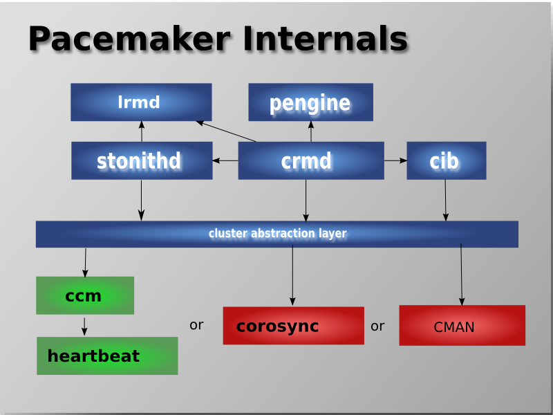
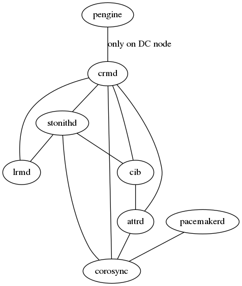
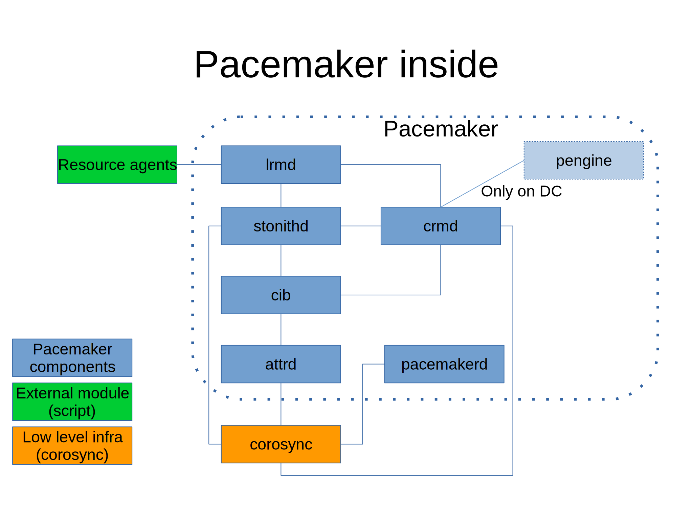

=================================================
Pacemaker inside
=================================================

Architecture
--------------------------------

Quote from http://clusterlabs.org/

Key components of pacemaker

- Cluster Information Base (CIB)
- Cluster Resource Management daemon (CRMd)
- Local Resource Management daemon (LRMd)
- Policy Engine (PEngine or PE)
- Fencing daemon (STONITHd)

Related source packages
-----------------------------

* pacemaker
* resource-agetns
* libqb
* corosync

Above source code are converted to `hyper text <http://trac.nrt.redhat.com/~yamato/pacemaker>`_.

Related processes
--------------------
pacemaker
::
   
   [root@a2 ~]# systemctl status pacemaker.service
   ● pacemaker.service - Pacemaker High Availability Cluster Manager
   Loaded: loaded (/usr/lib/systemd/system/pacemaker.service; enabled; vendor preset: disabled)
   Active: active (running) since Tue 2016-05-24 11:20:24 JST; 26min ago
   Main PID: 30036 (pacemakerd)
   CGroup: /system.slice/pacemaker.service
	  ├─30036 /usr/sbin/pacemakerd -f
	  ├─30037 /usr/libexec/pacemaker/cib
	  ├─30038 /usr/libexec/pacemaker/stonithd
	  ├─30039 /usr/libexec/pacemaker/lrmd
	  ├─30040 /usr/libexec/pacemaker/attrd
	  ├─30041 /usr/libexec/pacemaker/pengine
	  ├─30042 /usr/libexec/pacemaker/crmd
										

	  
All key components (CIB, CRMd, LRMd, PEngine, STONITHd) appear in CGroup of pacemaker. The "attrd" process, which is not a member of key components in the above figure and descriptions, also appears in CGroup of pacemaker.

Connections between components of pacemaker
-------------------------------------------------------

To look into connections between the internal components of pacemaker, I'd like to start with crmd (PID=30042)
::

   [root@a2 ~]# lsof -p 30042
   COMMAND   PID      USER   FD      TYPE             DEVICE SIZE/OFF     NODE NAME
   crmd    30042 hacluster  cwd       DIR              253,0       22 33720369 /var/lib/pacemaker/cores
   crmd    30042 hacluster  rtd       DIR              253,0     4096      128 /
   crmd    30042 hacluster  txt       REG              253,0   349688 17317430 /usr/libexec/pacemaker/crmd
   crmd    30042 hacluster  mem       REG               0,17   135168    61775 /dev/shm/qb-attrd-event-30040-30042-10-data
   crmd    30042 hacluster  mem       REG               0,17   135168    61773 /dev/shm/qb-attrd-response-30040-30042-10-data
   crmd    30042 hacluster  mem       REG               0,17   135168    61771 /dev/shm/qb-attrd-request-30040-30042-10-data
   crmd    30042 hacluster  mem       REG               0,17   135168    61722 /dev/shm/qb-stonith-ng-event-30038-30042-10-data
   crmd    30042 hacluster  mem       REG               0,17   135168    61720 /dev/shm/qb-stonith-ng-response-30038-30042-10-data
   crmd    30042 hacluster  mem       REG               0,17   135168    61718 /dev/shm/qb-stonith-ng-request-30038-30042-10-data
   crmd    30042 hacluster  mem       REG               0,17   135168    62964 /dev/shm/qb-lrmd-event-30039-30042-8-data
   crmd    30042 hacluster  mem       REG               0,17  1052672    62914 /dev/shm/qb-quorum-event-30021-30042-25-data
   crmd    30042 hacluster  mem       REG               0,17  1052672    62912 /dev/shm/qb-quorum-response-30021-30042-25-data
   crmd    30042 hacluster  mem       REG               0,17  1052672    62910 /dev/shm/qb-quorum-request-30021-30042-25-data
   crmd    30042 hacluster  mem       REG               0,17  1052672    62885 /dev/shm/qb-cpg-event-30021-30042-23-data
   crmd    30042 hacluster  mem       REG               0,17  1052672    62883 /dev/shm/qb-cpg-response-30021-30042-23-data
   crmd    30042 hacluster  mem       REG               0,17  1052672    62881 /dev/shm/qb-cpg-request-30021-30042-23-data
   crmd    30042 hacluster  mem       REG               0,17   528384    61681 /dev/shm/qb-cib_shm-event-30037-30042-11-data
   crmd    30042 hacluster  mem       REG               0,17   528384    61679 /dev/shm/qb-cib_shm-response-30037-30042-11-data
   crmd    30042 hacluster  mem       REG              253,0    61928 33919248 /usr/lib64/libnss_files-2.17.so
   crmd    30042 hacluster  mem       REG              253,0   398264 33763412 /usr/lib64/libpcre.so.1.2.0
   crmd    30042 hacluster  mem       REG              253,0   147096 33763422 /usr/lib64/libselinux.so.1
   crmd    30042 hacluster  mem       REG              253,0   110808 33919258 /usr/lib64/libresolv-2.17.so
   crmd    30042 hacluster  mem       REG              253,0    15688 33836062 /usr/lib64/libkeyutils.so.1.5
   crmd    30042 hacluster  mem       REG              253,0    62720 33867687 /usr/lib64/libkrb5support.so.0.1
   crmd    30042 hacluster  mem       REG              253,0   202576 34220670 /usr/lib64/libk5crypto.so.3.1
   crmd    30042 hacluster  mem       REG              253,0    15840 33763495 /usr/lib64/libcom_err.so.2.1
   crmd    30042 hacluster  mem       REG              253,0   950496 33867685 /usr/lib64/libkrb5.so.3.3
   crmd    30042 hacluster  mem       REG              253,0   316528 34220668 /usr/lib64/libgssapi_krb5.so.2.2
   crmd    30042 hacluster  mem       REG              253,0   449880 33867700 /usr/lib64/libssl.so.1.0.1e
   crmd    30042 hacluster  mem       REG              253,0  2017168 33867698 /usr/lib64/libcrypto.so.1.0.1e
   crmd    30042 hacluster  mem       REG              253,0    32296 33763533 /usr/lib64/libffi.so.6.0.1
   crmd    30042 hacluster  mem       REG              253,0   118792 33763436 /usr/lib64/libaudit.so.1.0.0
   crmd    30042 hacluster  mem       REG              253,0   153192 33721430 /usr/lib64/liblzma.so.5.0.99
   crmd    30042 hacluster  mem       REG              253,0  1141560 33919238 /usr/lib64/libm-2.17.so
   crmd    30042 hacluster  mem       REG              253,0   494440 34220665 /usr/lib64/libgmp.so.10.2.0
   crmd    30042 hacluster  mem       REG              253,0   160720 33836129 /usr/lib64/libhogweed.so.2.5
   crmd    30042 hacluster  mem       REG              253,0   201280 33836131 /usr/lib64/libnettle.so.4.7
   crmd    30042 hacluster  mem       REG              253,0    82144 33836096 /usr/lib64/libtasn1.so.6.2.3
   crmd    30042 hacluster  mem       REG              253,0   465384 34157054 /usr/lib64/libtspi.so.1.2.0
   crmd    30042 hacluster  mem       REG              253,0   290864 33763916 /usr/lib64/libp11-kit.so.0.0.0
   crmd    30042 hacluster  mem       REG              253,0    90632 33763425 /usr/lib64/libz.so.1.2.7
   crmd    30042 hacluster  mem       REG              253,0   142304 33919256 /usr/lib64/libpthread-2.17.so
   crmd    30042 hacluster  mem       REG              253,0    44096 33919260 /usr/lib64/librt-2.17.so
   crmd    30042 hacluster  mem       REG              253,0    19520 33919236 /usr/lib64/libdl-2.17.so
   crmd    30042 hacluster  mem       REG              253,0   152704 33719390 /usr/lib64/libqb.so.0.17.1
   crmd    30042 hacluster  mem       REG              253,0    41248 33719395 /usr/lib64/libltdl.so.7.3.0
   crmd    30042 hacluster  mem       REG              253,0  1287904 33763537 /usr/lib64/libglib-2.0.so.0.4200.2
   crmd    30042 hacluster  mem       REG              253,0    61648 33981714 /usr/lib64/libpam.so.0.83.1
   crmd    30042 hacluster  mem       REG              253,0    20032 33981902 /usr/lib64/libuuid.so.1.3.0
   crmd    30042 hacluster  mem       REG              253,0  2112384 33919230 /usr/lib64/libc-2.17.so
   crmd    30042 hacluster  mem       REG              253,0  1505208 33763518 /usr/lib64/libxml2.so.2.9.1
   crmd    30042 hacluster  mem       REG              253,0   258344 33836141 /usr/lib64/libxslt.so.1.1.28
   crmd    30042 hacluster  mem       REG              253,0    68192 33763442 /usr/lib64/libbz2.so.1.0.6
   crmd    30042 hacluster  mem       REG              253,0    10912 33719464 /usr/lib64/libcorosync_common.so.4.0.0
   crmd    30042 hacluster  mem       REG              253,0  1279960 34157059 /usr/lib64/libgnutls.so.28.41.0
   crmd    30042 hacluster  mem       REG              253,0    11224 33719468 /usr/lib64/libquorum.so.5.0.0
   crmd    30042 hacluster  mem       REG              253,0    23864 33719462 /usr/lib64/libcmap.so.4.1.0
   crmd    30042 hacluster  mem       REG              253,0    15216 33719460 /usr/lib64/libcfg.so.6.0.0
   crmd    30042 hacluster  mem       REG              253,0    23640 33719466 /usr/lib64/libcpg.so.4.1.0
   crmd    30042 hacluster  mem       REG              253,0   304536 33764042 /usr/lib64/libdbus-1.so.3.7.4
   crmd    30042 hacluster  mem       REG              253,0    55480 33719505 /usr/lib64/liblrmd.so.1.2.1
   crmd    30042 hacluster  mem       REG              253,0    89856 33719503 /usr/lib64/libcrmservice.so.3.0.0
   crmd    30042 hacluster  mem       REG              253,0   354960 33719501 /usr/lib64/libcrmcommon.so.3.5.0
   crmd    30042 hacluster  mem       REG              253,0    95384 33719520 /usr/lib64/libcrmcluster.so.4.1.0
   crmd    30042 hacluster  mem       REG              253,0   127920 33719499 /usr/lib64/libcib.so.4.0.2
   crmd    30042 hacluster  mem       REG              253,0    42576 33719507 /usr/lib64/libpe_rules.so.2.0.5
   crmd    30042 hacluster  mem       REG              253,0    32560 33719515 /usr/lib64/libtransitioner.so.2.0.4
   crmd    30042 hacluster  mem       REG              253,0    63496 33719513 /usr/lib64/libstonithd.so.2.1.3
   crmd    30042 hacluster  mem       REG              253,0   164440 33919225 /usr/lib64/ld-2.17.so
   crmd    30042 hacluster  mem       REG               0,17     8248    61774 /dev/shm/qb-attrd-event-30040-30042-10-header
   crmd    30042 hacluster  mem       REG               0,17     8248    61772 /dev/shm/qb-attrd-response-30040-30042-10-header
   crmd    30042 hacluster  mem       REG               0,17     8252    61770 /dev/shm/qb-attrd-request-30040-30042-10-header
   crmd    30042 hacluster  mem       REG               0,17     8248    61721 /dev/shm/qb-stonith-ng-event-30038-30042-10-header
   crmd    30042 hacluster  mem       REG               0,17     8248    61719 /dev/shm/qb-stonith-ng-response-30038-30042-10-header
   crmd    30042 hacluster  mem       REG               0,17     8252    61717 /dev/shm/qb-stonith-ng-request-30038-30042-10-header
   crmd    30042 hacluster  mem       REG               0,17     8248    62963 /dev/shm/qb-lrmd-event-30039-30042-8-header
   crmd    30042 hacluster  mem       REG               0,17   135168    62962 /dev/shm/qb-lrmd-response-30039-30042-8-data
   crmd    30042 hacluster  mem       REG               0,17     8248    62961 /dev/shm/qb-lrmd-response-30039-30042-8-header
   crmd    30042 hacluster  mem       REG               0,17   135168    62960 /dev/shm/qb-lrmd-request-30039-30042-8-data
   crmd    30042 hacluster  mem       REG               0,17     8252    62959 /dev/shm/qb-lrmd-request-30039-30042-8-header
   crmd    30042 hacluster  mem       REG               0,17     8248    62913 /dev/shm/qb-quorum-event-30021-30042-25-header
   crmd    30042 hacluster  mem       REG               0,17     8248    62911 /dev/shm/qb-quorum-response-30021-30042-25-header
   crmd    30042 hacluster  mem       REG               0,17     8252    62909 /dev/shm/qb-quorum-request-30021-30042-25-header
   crmd    30042 hacluster  mem       REG               0,17     8248    62884 /dev/shm/qb-cpg-event-30021-30042-23-header
   crmd    30042 hacluster  mem       REG               0,17     8248    62882 /dev/shm/qb-cpg-response-30021-30042-23-header
   crmd    30042 hacluster  mem       REG               0,17     8252    62880 /dev/shm/qb-cpg-request-30021-30042-23-header
   crmd    30042 hacluster  mem       REG               0,17     8248    61680 /dev/shm/qb-cib_shm-event-30037-30042-11-header
   crmd    30042 hacluster  mem       REG               0,17   528384    61677 /dev/shm/qb-cib_shm-request-30037-30042-11-data
   crmd    30042 hacluster  mem       REG               0,17     8248    61678 /dev/shm/qb-cib_shm-response-30037-30042-11-header
   crmd    30042 hacluster  mem       REG               0,17     8252    61676 /dev/shm/qb-cib_shm-request-30037-30042-11-header
   crmd    30042 hacluster    0r      CHR                1,3      0t0     5695 /dev/null
   crmd    30042 hacluster    1w      CHR                1,3      0t0     5695 /dev/null
   crmd    30042 hacluster    2w      CHR                1,3      0t0     5695 /dev/null
   crmd    30042 hacluster    3r      CHR                1,9      0t0     5700 /dev/urandom
   crmd    30042 hacluster    4u  a_inode                0,9        0     5691 [eventfd]
   crmd    30042 hacluster    5u      REG              253,0   709785 17317506 /var/log/cluster/corosync.log
   crmd    30042 hacluster    6u     unix 0xffff88003c25a580      0t0    61639 socket
   crmd    30042 hacluster    7u     unix 0xffff88003c258000      0t0    61674 socket
   crmd    30042 hacluster    8u     unix 0xffff88003c25a1c0      0t0    61682 socket
   crmd    30042 hacluster    9u     unix 0xffff88003c258b40      0t0    61686 socket
   crmd    30042 hacluster   10u     unix 0xffff88003c814f00      0t0    61710 socket
   crmd    30042 hacluster   11u     unix 0xffff88003c815680      0t0    61714 @crmd
   crmd    30042 hacluster   12u     unix 0xffff88003c814780      0t0    61715 socket
   crmd    30042 hacluster   13u     unix 0xffff88003c815e00      0t0    61768 socket

crmd seems to communicate with other components through socket.
::

   [root@a2 ~]# ss -axp  | grep crmd
   u_str  LISTEN     0      128    @crmd 61714                 * 0                     users:(("crmd",pid=30042,fd=11))
   u_dgr  UNCONN     0      0       * 61639                 * 295                   users:(("crmd",pid=30042,fd=6))
   u_str  ESTAB      0      0       * 61682                 * 62879                 users:(("crmd",pid=30042,fd=8))
   u_str  ESTAB      0      0       * 61715                 * 61716                 users:(("crmd",pid=30042,fd=12))
   u_str  ESTAB      0      0       * 61674                 * 61675                 users:(("crmd",pid=30042,fd=7))
   u_str  ESTAB      0      0       * 61686                 * 62908                 users:(("crmd",pid=30042,fd=9))
   u_str  ESTAB      0      0       * 61768                 * 61769                 users:(("crmd",pid=30042,fd=13))
   u_str  ESTAB      0      0       * 61710                 * 62958                 users:(("crmd",pid=30042,fd=10))

Who is connecting with crmd?
ESTABLISHED socket connections with crmd are
::
   
   [root@a2 ~]# ss -axp  | grep 62879
   u_str  ESTAB      0      0       * 61682                 * 62879                 users:(("crmd",pid=30042,fd=8))
   u_str  ESTAB      0      0      @cpg 62879                 * 61682                 users:(("corosync",pid=30021,fd=23))
   [root@a2 ~]# ss -axp  | grep 61716
   u_str  ESTAB      0      0      @stonith-ng 61716                 * 61715                 users:(("stonithd",pid=30038,fd=10))
   u_str  ESTAB      0      0       * 61715                 * 61716                 users:(("crmd",pid=30042,fd=12))
   [root@a2 ~]# ss -axp  | grep 61675
   u_str  ESTAB      0      0      @cib_shm 61675                 * 61674                 users:(("cib",pid=30037,fd=11))
   u_str  ESTAB      0      0       * 61674                 * 61675                 users:(("crmd",pid=30042,fd=7))
   [root@a2 ~]# ss -axp  | grep 62908
   u_str  ESTAB      0      0      @quorum 62908                 * 61686                 users:(("corosync",pid=30021,fd=25))
   u_str  ESTAB      0      0       * 61686                 * 62908                 users:(("crmd",pid=30042,fd=9))
   [root@a2 ~]# ss -axp  | grep 61769
   u_str  ESTAB      0      0      @attrd 61769                 * 61768                 users:(("attrd",pid=30040,fd=10))
   u_str  ESTAB      0      0       * 61768                 * 61769                 users:(("crmd",pid=30042,fd=13))
   [root@a2 ~]# ss -axp  | grep 62958
   u_str  ESTAB      0      0      @lrmd 62958                 * 61710                 users:(("lrmd",pid=30039,fd=8))
   u_str  ESTAB      0      0       * 61710                 * 62958                 users:(("crmd",pid=30042,fd=10))

Turned out that corosync, stonithd, cib, attrd, and lrmd are connecting with crmd through sockets. Adding to that, crmd is listening on port 61714.

"295" is the listening port of systemd-journal for logging.
::
   
   [root@a2 ~]# ss -axp  | grep " 295 "
   u_dgr  UNCONN     0      0      /dev/log 295                   * 0                     users:(("systemd-journal",pid=494,fd=5),("systemd",pid=1,fd=27))
   u_dgr  UNCONN     0      0       * 16637                 * 295                   users:(("master",pid=910,fd=3))
   u_dgr  UNCONN     0      0       * 17299                 * 295                   users:(("polkitd",pid=1381,fd=10))
   u_dgr  UNCONN     0      0       * 62657                 * 295                   users:(("pacemakerd",pid=30036,fd=5))
   u_dgr  UNCONN     0      0       * 61639                 * 295                   users:(("crmd",pid=30042,fd=6))
   u_dgr  UNCONN     0      0       * 15424                 * 295                   users:(("dbus-daemon",pid=657,fd=12))
   u_dgr  UNCONN     0      0       * 75580                 * 295                   users:(("sshd",pid=6989,fd=4))
   u_dgr  UNCONN     0      0       * 61649                 * 295                   users:(("pengine",pid=30041,fd=6))
   u_dgr  UNCONN     0      0       * 17667                 * 295                   users:(("qmgr",pid=919,fd=7))
   u_dgr  UNCONN     0      0       * 15209                 * 295                   users:(("crond",pid=702,fd=4))
   u_dgr  UNCONN     0      0       * 62516                 * 295                   users:(("corosync",pid=30021,fd=4))
   u_dgr  UNCONN     0      0       * 62718                 * 295                   users:(("lrmd",pid=30039,fd=5))
   u_dgr  UNCONN     0      0       * 61630                 * 295                   users:(("cib",pid=30037,fd=6))
   u_dgr  UNCONN     0      0       * 65259                 * 295                   users:(("pickup",pid=32391,fd=7))
   u_dgr  UNCONN     0      0       * 13310                 * 295                   users:(("auditd",pid=630,fd=5))
   u_dgr  UNCONN     0      0       * 18449                 * 295                   users:(("rhnsd",pid=1471,fd=0))
   u_dgr  UNCONN     0      0       * 16612                 * 295                   users:(("dhclient",pid=1377,fd=3))
   u_dgr  UNCONN     0      0       * 61631                 * 295                   users:(("attrd",pid=30040,fd=6))
   u_dgr  UNCONN     0      0       * 62754                 * 295                   users:(("stonithd",pid=30038,fd=5))

Next, on lrmd
::
   
   [root@a2 ~]# ss -axp  | grep lrmd
   u_str  LISTEN     0      128    @lrmd 62719                 * 0                     users:(("lrmd",pid=30039,fd=7))
   u_str  ESTAB      0      0       * 63077                 * 61777                 users:(("lrmd",pid=30039,fd=9))
   u_dgr  UNCONN     0      0       * 62718                 * 295                   users:(("lrmd",pid=30039,fd=5))
   u_str  ESTAB      0      0      @lrmd 62958                 * 61710                 users:(("lrmd",pid=30039,fd=8))

lrmd is listening on port 62719. Two established connections are between stonithd and crmd like follows.
::

   [root@a2 ~]# ss -axp  | grep 61777
   u_str  ESTAB      0      0       * 63077                 * 61777                 users:(("lrmd",pid=30039,fd=9))
   u_str  ESTAB      0      0      @stonith-ng 61777                 * 63077                 users:(("stonithd",pid=30038,fd=11))
   [root@a2 ~]# ss -axp  | grep 61710
   u_str  ESTAB      0      0      @lrmd 62958                 * 61710                 users:(("lrmd",pid=30039,fd=8))
   u_str  ESTAB      0      0       * 61710                 * 62958                 users:(("crmd",pid=30042,fd=10))

How about stonithd, then?
::
   
   [root@a2 ~]# ss -axp  | grep stonithd
   u_str  LISTEN     0      128    @stonith-ng 61697                 * 0                     users:(("stonithd",pid=30038,fd=9))
   u_str  ESTAB      0      0       * 62755                 * 62756                 users:(("stonithd",pid=30038,fd=7))
   u_str  ESTAB      0      0       * 61688                 * 61689                 users:(("stonithd",pid=30038,fd=8))
   u_str  ESTAB      0      0      @stonith-ng 61716                 * 61715                 users:(("stonithd",pid=30038,fd=10))
   u_str  ESTAB      0      0      @stonith-ng 61777                 * 63077                 users:(("stonithd",pid=30038,fd=11))
   u_dgr  UNCONN     0      0       * 62754                 * 295                   users:(("stonithd",pid=30038,fd=5))

stonithd is listening on pot 61697 and connecting with corosync, cib, crmd, and lrmd like follows.
::

   [root@a2 ~]# ss -axp  | grep 62756
   u_str  ESTAB      0      0       * 62755                 * 62756                 users:(("stonithd",pid=30038,fd=7))
   u_str  ESTAB      0      0      @cpg 62756                 * 62755                 users:(("corosync",pid=30021,fd=22))
   [root@a2 ~]# ss -axp  | grep 61689
   u_str  ESTAB      0      0      @cib_rw 61689                 * 61688                 users:(("cib",pid=30037,fd=12))
   u_str  ESTAB      0      0       * 61688                 * 61689                 users:(("stonithd",pid=30038,fd=8))
   [root@a2 ~]# ss -axp  | grep 61715
   u_str  ESTAB      0      0      @stonith-ng 61716                 * 61715                 users:(("stonithd",pid=30038,fd=10))
   u_str  ESTAB      0      0       * 61715                 * 61716                 users:(("crmd",pid=30042,fd=12))
   [root@a2 ~]# ss -axp  | grep 63077
   u_str  ESTAB      0      0       * 63077                 * 61777                 users:(("lrmd",pid=30039,fd=9))
   u_str  ESTAB      0      0      @stonith-ng 61777                 * 63077                 users:(("stonithd",pid=30038,fd=11))

cib
::
   [root@a2 ~]# ss -axp  | grep cib
   u_str  LISTEN     0      128    @cib_ro 62850                 * 0                     users:(("cib",pid=30037,fd=8))
   u_str  LISTEN     0      128    @cib_rw 62851                 * 0                     users:(("cib",pid=30037,fd=9))
   u_str  LISTEN     0      128    @cib_shm 62852                 * 0                     users:(("cib",pid=30037,fd=10))
   u_str  ESTAB      0      0      @cib_rw 61700                 * 61699                 users:(("cib",pid=30037,fd=13))
   u_str  ESTAB      0      0      @cib_rw 61689                 * 61688                 users:(("cib",pid=30037,fd=12))
   u_str  ESTAB      0      0      @cib_shm 61675                 * 61674                 users:(("cib",pid=30037,fd=11))
   u_str  ESTAB      0      0       * 61644                 * 62785                 users:(("cib",pid=30037,fd=7))
   u_dgr  UNCONN     0      0       * 61630                 * 295                   users:(("cib",pid=30037,fd=6))

cib is listening on port 62850, 62851, and 62852 and connecting with attrd, stonithd, and crmd.
::

   [root@a2 ~]# ss -axp  | grep 61699
   u_str  ESTAB      0      0      @cib_rw 61700                 * 61699                 users:(("cib",pid=30037,fd=13))
   u_str  ESTAB      0      0       * 61699                 * 61700                 users:(("attrd",pid=30040,fd=9))
   [root@a2 ~]# ss -axp  | grep 61688
   u_str  ESTAB      0      0      @cib_rw 61689                 * 61688                 users:(("cib",pid=30037,fd=12))
   u_str  ESTAB      0      0       * 61688                 * 61689                 users:(("stonithd",pid=30038,fd=8))
   [root@a2 ~]# ss -axp  | grep 61674
   u_str  ESTAB      0      0      @cib_shm 61675                 * 61674                 users:(("cib",pid=30037,fd=11))
   u_str  ESTAB      0      0       * 61674                 * 61675                 users:(("crmd",pid=30042,fd=7))
   
attrd is connecting with crmd, corosync, and cib
::

   [root@a2 ~]# ss -axp  | grep attrd
   u_str  LISTEN     0      128    @attrd 61671                 * 0                     users:(("attrd",pid=30040,fd=8))
   u_str  ESTAB      0      0      @attrd 61769                 * 61768                 users:(("attrd",pid=30040,fd=10))
   u_dgr  UNCONN     0      0       * 61631                 * 295                   users:(("attrd",pid=30040,fd=6))
   u_str  ESTAB      0      0       * 61634                 * 62736                 users:(("attrd",pid=30040,fd=7))
   u_str  ESTAB      0      0       * 61699                 * 61700                 users:(("attrd",pid=30040,fd=9))
   [root@a2 ~]# ss -axp  | grep 61768
   u_str  ESTAB      0      0      @attrd 61769                 * 61768                 users:(("attrd",pid=30040,fd=10))
   u_str  ESTAB      0      0       * 61768                 * 61769                 users:(("crmd",pid=30042,fd=13))
   [root@a2 ~]# ss -axp  | grep 62736
   u_str  ESTAB      0      0      @cpg 62736                 * 61634                 users:(("corosync",pid=30021,fd=21))
   u_str  ESTAB      0      0       * 61634                 * 62736                 users:(("attrd",pid=30040,fd=7))
   [root@a2 ~]# ss -axp  | grep 61700
   u_str  ESTAB      0      0      @cib_rw 61700                 * 61699                 users:(("cib",pid=30037,fd=13))
   u_str  ESTAB      0      0       * 61699                 * 61700                 users:(("attrd",pid=30040,fd=9))
   
How about PEngine?
::

   [root@a2 ~]# ss -axp  | grep pengine
   u_str  LISTEN     0      128    @pengine 61654                 * 0                     users:(("pengine",pid=30041,fd=7))
   u_dgr  UNCONN     0      0       * 61649                 * 295                   users:(("pengine",pid=30041,fd=6))

pengine is listening on port on 61654. There is no established connections on node a2. However on node a1, which is DC on the cluster,
::

   [root@a1 ~]# ss -axp  | grep pengine
   u_str  LISTEN     0      128    @pengine 19553                 * 0                     users:(("pengine",pid=2474,fd=7))
   u_str  ESTAB      0      0      @pengine 20589                 * 20588                 users:(("pengine",pid=2474,fd=8))
   u_dgr  UNCONN     0      0       * 19548                 * 7382                  users:(("pengine",pid=2474,fd=6))

   [root@a1 ~]# ss -axp  | grep 20588
   u_str  ESTAB      0      0       * 20588                 * 20589                 users:(("crmd",pid=2477,fd=13))
   u_str  ESTAB      0      0      @pengine 20589                 * 20588                 users:(("pengine",pid=2474,fd=8))

pengine is connecting with crmd "only" on the DC node.
   
Finally, we must not forget pacemakerd..
::

   [root@a1 ~]# ss -axp  | grep pacemaker
   u_str  LISTEN     0      128    @pacemakerd 19115                 * 0                     users:(("pacemakerd",pid=2238,fd=6))
   u_str  ESTAB      0      0       * 18337                 * 18338                 users:(("pacemakerd",pid=2238,fd=1))
   u_str  ESTAB      0      0       * 19116                 * 19117                 users:(("pacemakerd",pid=2238,fd=7))
   u_str  ESTAB      0      0       * 19160                 * 19161                 users:(("pacemakerd",pid=2238,fd=9))
   u_str  ESTAB      0      0       * 19184                 * 19185                 users:(("pacemakerd",pid=2238,fd=10))
   u_dgr  UNCONN     0      0       * 19113                 * 7382                  users:(("pacemakerd",pid=2238,fd=5))
   [root@a1 ~]# ss -axp  | grep 18338
   u_str  ESTAB      0      0       * 18337                 * 18338                 users:(("pacemakerd",pid=2238,fd=1))
   u_str  ESTAB      0      0      /run/systemd/journal/stdout 18338                 * 18337                 users:(("systemd-journal",pid=494,fd=17))
   [root@a1 ~]# ss -axp  | grep 19117
   u_str  ESTAB      0      0       * 19116                 * 19117                 users:(("pacemakerd",pid=2238,fd=7))
   u_str  ESTAB      0      0      @cfg 19117                 * 19116                 users:(("corosync",pid=1619,fd=18))
   [root@a1 ~]# ss -axp  | grep 19161
   u_str  ESTAB      0      0      @cpg 19161                 * 19160                 users:(("corosync",pid=1619,fd=19))
   u_str  ESTAB      0      0       * 19160                 * 19161                 users:(("pacemakerd",pid=2238,fd=9))
   [root@a1 ~]# ss -axp  | grep 19185
   u_str  ESTAB      0      0      @quorum 19185                 * 19184                 users:(("corosync",pid=1619,fd=20))
   u_str  ESTAB      0      0       * 19184                 * 19185                 users:(("pacemakerd",pid=2238,fd=10))
   [root@a1 ~]# ss -axp  | grep 7382
   u_dgr  UNCONN     0      0      /dev/log 7382                  * 0                     users:(("systemd-journal",pid=494,fd=5),("systemd",pid=1,fd=27))
   .
   .
   u_dgr  UNCONN     0      0       * 19113                 * 7382                  users:(("pacemakerd",pid=2238,fd=5))

pacemaker's established connections are only with corosync. It also listens on port 19115.   

All together, the connections between components of pacemaker and corosync are like follows,

Message flow between DC (Designated Controller) and the rest
......................................................................
One of the crmd instances is elected as DC (Designated Controller) and act as a master. The node on which DC resides, we call it DC node.
Pengine, which is a brain of the cluster calculating status and giving instructions to crmd, is activated only on the DC node.  

.. image:: pacemaker-inside-pic-2.svg

On the DC node, the instructions from Pengine are received by crmd. The crmd on the DC node sends out instructions to peer crmds on the rest of the nodes in the cluster and at the same time to the lrmd on the DC node. The instructions received by crmds on non-DC node are then sent out to the local lrmd.
	   
	   
Functionality
------------------------------------------

Case study : Monitoring resources
.........................................

Cluster initialization phase
^^^^^^^^^^^^^^^^^^^^^^^^^^^^^^^^^^^^^^^^^^^^^
lrmd process seems to monitor local resources. Let's investigate the life cycle of lrmd process.
Looking into lrmd related log (/var/log/cluster/corosync.log) of cluster initialization.
::

   [mihara@wlan-197-60 doc]$ less ../data/corosync-start.log | grep lrmd
   May 24 16:34:25 [3789] a3.pm.redhat.com pacemakerd:     info: start_child:Forked child 3792 for process lrmd
   May 24 16:34:25 [3792] a3.pm.redhat.com       lrmd:     info: crm_log_init:Changed active directory to /var/lib/pacemaker/cores/root
   May 24 16:34:25 [3792] a3.pm.redhat.com       lrmd:     info: qb_ipcs_us_publish:server name: lrmd
   May 24 16:34:25 [3792] a3.pm.redhat.com       lrmd:     info: main:Starting
   May 24 16:34:26 [3795] a3.pm.redhat.com       crmd:     info: lrmd_ipc_connect:Connecting to lrmd
   May 24 16:34:31 [3792] a3.pm.redhat.com       lrmd:     info: process_lrmd_get_rsc_info:Resource 'node1-xvm' not found (0 active resources)
   May 24 16:34:31 [3792] a3.pm.redhat.com       lrmd:     info: process_lrmd_rsc_register:Added 'node1-xvm' to the rsc list (1 active resources)
   May 24 16:34:31 [3792] a3.pm.redhat.com       lrmd:     info: process_lrmd_get_rsc_info:Resource 'node2-xvm' not found (1 active resources)
   May 24 16:34:31 [3792] a3.pm.redhat.com       lrmd:     info: process_lrmd_rsc_register:Added 'node2-xvm' to the rsc list (2 active resources)
   May 24 16:34:32 [3792] a3.pm.redhat.com       lrmd:     info: process_lrmd_get_rsc_info:Resource 'node3-xvm' not found (2 active resources)
   May 24 16:34:32 [3792] a3.pm.redhat.com       lrmd:     info: process_lrmd_rsc_register:Added 'node3-xvm' to the rsc list (3 active resources)
   May 24 16:34:32 [3792] a3.pm.redhat.com       lrmd:     info: process_lrmd_get_rsc_info:Resource 'ClusterIP:0' not found (3 active resources)
   May 24 16:34:32 [3792] a3.pm.redhat.com       lrmd:     info: process_lrmd_rsc_register:Added 'ClusterIP:0' to the rsc list (4 active resources)
   May 24 16:34:32 [3792] a3.pm.redhat.com       lrmd:     info: process_lrmd_get_rsc_info:Resource 'ClusterIP:1' not found (4 active resources)
   May 24 16:34:32 [3792] a3.pm.redhat.com       lrmd:     info: process_lrmd_rsc_register:Added 'ClusterIP:1' to the rsc list (5 active resources)
   May 24 16:34:32 [3792] a3.pm.redhat.com       lrmd:     info: process_lrmd_get_rsc_info:Resource 'ClusterIP:2' not found (5 active resources)
   May 24 16:34:32 [3792] a3.pm.redhat.com       lrmd:     info: process_lrmd_rsc_register:Added 'ClusterIP:2' to the rsc list (6 active resources)
   May 24 16:34:32 [3792] a3.pm.redhat.com       lrmd:     info: process_lrmd_get_rsc_info:Resource 'webserver' not found (6 active resources)
   May 24 16:34:32 [3792] a3.pm.redhat.com       lrmd:     info: process_lrmd_get_rsc_info:Resource 'webserver:0' not found (6 active resources)
   May 24 16:34:32 [3792] a3.pm.redhat.com       lrmd:     info: process_lrmd_rsc_register:Added 'webserver' to the rsc list (7 active resources)
   May 24 16:34:32 [3792] a3.pm.redhat.com       lrmd:     info: log_execute:executing - rsc:node3-xvm action:start call_id:31
   May 24 16:34:32 [3792] a3.pm.redhat.com       lrmd:     info: log_finished:finished - rsc:node3-xvm action:start call_id:31  exit-code:0 exec-time:27ms queue-time:0ms

Seems that process_lrmd_get_rsc_info and process_lrmd_rsc_register are handling a registration of resources to be monitored.
In the source code of pacemaker, process_lrmd_get_rsc_info is implemented in /^rhel-server-7-2-source-iso/pr\
407e-build/pacemaker-44eb2ddf8d4f8fc05256aae2abc9fbf3ae4d1fbc/lrmd/lrmd.c line : 1418-
::

   lrmd/lrmd.c:1418: static void
              :1419: process_lrmd_get_rsc_info(crm_client_t * client, uint32_t id, xmlNode * request)

In this function, resource-info seems to be stored in CIB.
As for process_lrmd_rsc_register, build_rsc_from_xml() function is called within.
   

process_lrmd_rsc_register is implemented in /^rhel-server-7-2-source-iso/pr\
e-build/pacemaker-44eb2ddf8d4f8fc05256aae2abc9fbf3ae4d1fbc/lrmd/lrmd.c line : 1394-
::

   lrmd/lrmd.c:1394: process_lrmd_rsc_register(crm_client_t * client, uint32_t id, xmlNode * request)
   lrmd/lrmd.c:1636: process_lrmd_message
   lrmd/main.c:110: lrmd_ipc_dispatch
   lrmd/main.c:179: static struct qb_ipcs_service_handlers lrmd_ipc_callbacks
   lrmd/main.c:328: in main function: ipcs = mainloop_add_ipc_server(CRM_SYSTEM_LRMD, QB_IPC_SHM, &lrmd_ipc_callbacks);

   mainloop_add_ipc_server() is implemented in lib/common/mainloop.c:585-

in mainloop_add_ipc_server(), functions like qb_ipcs... are called. They are from libqb and implementations are found in
/sources/l/libqb/^rhel-server-7-2-source-iso/pre-build/libqb-0.17.1/lib/ipcs.c
::
   37qb_ipcs_create(const char *name,
   38               int32_t service_id,
   39               enum qb_ipc_type type, struct qb_ipcs_service_handlers *handlers)

   81qb_ipcs_poll_handlers_set(struct qb_ipcs_service *s,
   82                          struct qb_ipcs_poll_handlers *handlers)

   104qb_ipcs_run(struct qb_ipcs_service *s)
	
Resource failure case
^^^^^^^^^^^^^^^^^^^^^^^^^^^^^^^^^^^^^^^^^^^^^^^^^^^^^^^^
Suspending WEB resource (killall -STOP httpd) results in fencing the node. 
Here is the log of the node, on which the WER resource was suspended. 
::

   May 24 15:46:41 [29153] a3.pm.redhat.com       lrmd:  warning: child_timeout_callback:webserver_monitor_10000 process (PID 26685) timed out
   May 24 15:46:41 [29153] a3.pm.redhat.com       lrmd:  warning: operation_finished:webserver_monitor_10000:26685 - timed out after 20000ms
   May 24 15:46:41 [29156] a3.pm.redhat.com       crmd:    error: process_lrm_event:Operation webserver_monitor_10000: Timed Out (node=a3, call=36, timeout=20000ms)
   May 24 15:46:41 [29151] a3.pm.redhat.com        cib:     info: cib_process_request:Forwarding cib_modify operation for section status to master (origin=local/crmd/72)
   May 24 15:46:41 [29151] a3.pm.redhat.com        cib:     info: cib_perform_op:Diff: --- 0.242.50 2
   May 24 15:46:41 [29151] a3.pm.redhat.com        cib:     info: cib_perform_op:Diff: +++ 0.242.51 (null)
   May 24 15:46:41 [29151] a3.pm.redhat.com        cib:     info: cib_perform_op:+  /cib:  @num_updates=51
   May 24 15:46:41 [29151] a3.pm.redhat.com        cib:     info: cib_perform_op:++ /cib/status/node_state[@id='3']/lrm[@id='3']/lrm_resources/lrm_resource[@id='webserver']:  <lrm_rsc_op id="webserver_last_failure_0" operation_key="webserver_monitor_10000" operation="monitor" crm-debug-origin="do_update_resource" crm_feature_set="3.0.10" transition-key="27:2:0:a459132e-e3b7-4093-91dc-e93cbe533358" transition-magic="2:1;27:2:0:a459132e-e3b7-4093-91dc-e93cbe533358" on_node="a3" call-id="36" rc-code="1" op-stat
   May 24 15:46:41 [29151] a3.pm.redhat.com        cib:     info: cib_process_request:Completed cib_modify operation for section status: OK (rc=0, origin=a3/crmd/72, version=0.242.51)
   May 24 15:46:41 [29156] a3.pm.redhat.com       crmd:     info: abort_transition_graph:Transition aborted by webserver_monitor_10000 'create' on a3: Old event (magic=2:1;27:2:0:a459132e-e3b7-4093-91dc-e93cbe533358, cib=0.242.51, source=process_graph_event:593, 1)
   May 24 15:46:41 [29156] a3.pm.redhat.com       crmd:     info: update_failcount:Updating failcount for webserver on a3 after failed monitor: rc=1 (update=value++, time=1464072401)
   May 24 15:46:41 [29156] a3.pm.redhat.com       crmd:     info: process_graph_event:Detected action (2.27) webserver_monitor_10000.36=unknown error: failed
   May 24 15:46:41 [29156] a3.pm.redhat.com       crmd:   notice: do_state_transition:State transition S_IDLE -> S_POLICY_ENGINE [ input=I_PE_CALC cause=C_FSA_INTERNAL origin=abort_transition_graph ]
   May 24 15:46:41 [29154] a3.pm.redhat.com      attrd:     info: attrd_client_update:Expanded fail-count-webserver=value++ to 1
   May 24 15:46:41 [29154] a3.pm.redhat.com      attrd:     info: attrd_peer_update:Setting fail-count-webserver[a3]: (null) -> 1 from a3
   May 24 15:46:41 [29154] a3.pm.redhat.com      attrd:     info: write_attribute:Sent update 9 with 1 changes for fail-count-webserver, id=<n/a>, set=(null)
   May 24 15:46:41 [29154] a3.pm.redhat.com      attrd:     info: attrd_peer_update:Setting last-failure-webserver[a3]: (null) -> 1464072401 from a3
   May 24 15:46:41 [29154] a3.pm.redhat.com      attrd:     info: write_attribute:Sent update 10 with 1 changes for last-failure-webserver, id=<n/a>, set=(null)
   May 24 15:46:41 [29151] a3.pm.redhat.com        cib:     info: cib_process_request:Forwarding cib_modify operation for section status to master (origin=local/attrd/9)
   May 24 15:46:41 [29151] a3.pm.redhat.com        cib:     info: cib_process_request:Forwarding cib_modify operation for section status to master (origin=local/attrd/10)
   May 24 15:46:41 [29151] a3.pm.redhat.com        cib:     info: cib_perform_op:Diff: --- 0.242.51 2
   May 24 15:46:41 [29151] a3.pm.redhat.com        cib:     info: cib_perform_op:Diff: +++ 0.242.52 (null)
   May 24 15:46:41 [29151] a3.pm.redhat.com        cib:     info: cib_perform_op:+  /cib:  @num_updates=52
   May 24 15:46:41 [29151] a3.pm.redhat.com        cib:     info: cib_perform_op:++ /cib/status/node_state[@id='3']/transient_attributes[@id='3']/instance_attributes[@id='status-3']:  <nvpair id="status-3-fail-count-webserver" name="fail-count-webserver" value="1"/>
   May 24 15:46:41 [29151] a3.pm.redhat.com        cib:     info: cib_process_request:Completed cib_modify operation for section status: OK (rc=0, origin=a3/attrd/9, version=0.242.52)
   May 24 15:46:41 [29151] a3.pm.redhat.com        cib:     info: cib_perform_op:Diff: --- 0.242.52 2
   May 24 15:46:41 [29151] a3.pm.redhat.com        cib:     info: cib_perform_op:Diff: +++ 0.242.53 (null)
   May 24 15:46:41 [29151] a3.pm.redhat.com        cib:     info: cib_perform_op:+  /cib:  @num_updates=53
   May 24 15:46:41 [29151] a3.pm.redhat.com        cib:     info: cib_perform_op:++ /cib/status/node_state[@id='3']/transient_attributes[@id='3']/instance_attributes[@id='status-3']:  <nvpair id="status-3-last-failure-webserver" name="last-failure-webserver" value="1464072401"/>
   May 24 15:46:41 [29154] a3.pm.redhat.com      attrd:     info: attrd_cib_callback:Update 9 for fail-count-webserver: OK (0)
   May 24 15:46:41 [29154] a3.pm.redhat.com      attrd:     info: attrd_cib_callback:Update 9 for fail-count-webserver[a3]=1: OK (0)
   May 24 15:46:41 [29151] a3.pm.redhat.com        cib:     info: cib_process_request:Completed cib_modify operation for section status: OK (rc=0, origin=a3/attrd/10, version=0.242.53)
   May 24 15:46:41 [29154] a3.pm.redhat.com      attrd:     info: attrd_cib_callback:Update 10 for last-failure-webserver: OK (0)
   May 24 15:46:41 [29154] a3.pm.redhat.com      attrd:     info: attrd_cib_callback:Update 10 for last-failure-webserver[a3]=1464072401: OK (0)
   May 24 15:46:41 [29156] a3.pm.redhat.com       crmd:     info: abort_transition_graph:Transition aborted by status-3-fail-count-webserver, fail-count-webserver=1: Transient attribute change (create cib=0.242.52, source=abort_unless_down:319, path=/cib/status/node_state[@id='3']/transient_attributes[@id='3']/instance_attributes[@id='status-3'], 1)
   May 24 15:46:41 [29156] a3.pm.redhat.com       crmd:     info: abort_transition_graph:Transition aborted by status-3-last-failure-webserver, last-failure-webserver=1464072401: Transient attribute change (create cib=0.242.53, source=abort_unless_down:319, path=/cib/status/node_state[@id='3']/transient_attributes[@id='3']/instance_attributes[@id='status-3'], 1)
   May 24 15:46:41 [29155] a3.pm.redhat.com    pengine:     info: determine_online_status_fencing:Node a2 is active
   May 24 15:46:41 [29155] a3.pm.redhat.com    pengine:     info: determine_online_status:Node a2 is online
   May 24 15:46:41 [29155] a3.pm.redhat.com    pengine:     info: determine_online_status_fencing:Node a3 is active
   May 24 15:46:41 [29155] a3.pm.redhat.com    pengine:     info: determine_online_status:Node a3 is online
   May 24 15:46:41 [29155] a3.pm.redhat.com    pengine:     info: determine_online_status_fencing:Node a1 is active
   May 24 15:46:41 [29155] a3.pm.redhat.com    pengine:     info: determine_online_status:Node a1 is online
   May 24 15:46:41 [29155] a3.pm.redhat.com    pengine:  warning: unpack_rsc_op_failure:Processing failed op monitor for webserver:1 on a3: unknown error (1)
   May 24 15:46:41 [29155] a3.pm.redhat.com    pengine:     info: native_print:node1-xvm(stonith:fence_xvm):Started a1
   May 24 15:46:41 [29155] a3.pm.redhat.com    pengine:     info: native_print:node2-xvm(stonith:fence_xvm):Started a2
   May 24 15:46:41 [29155] a3.pm.redhat.com    pengine:     info: native_print:node3-xvm(stonith:fence_xvm):Started a3
   May 24 15:46:41 [29155] a3.pm.redhat.com    pengine:     info: clone_print: Clone Set: ClusterIP-clone [ClusterIP] (unique)
   May 24 15:46:41 [29155] a3.pm.redhat.com    pengine:     info: native_print:     ClusterIP:0(ocf::heartbeat:IPaddr2):Started a1
   May 24 15:46:41 [29155] a3.pm.redhat.com    pengine:     info: native_print:     ClusterIP:1(ocf::heartbeat:IPaddr2):Started a2
   May 24 15:46:41 [29155] a3.pm.redhat.com    pengine:     info: native_print:     ClusterIP:2(ocf::heartbeat:IPaddr2):Started a3
   May 24 15:46:41 [29155] a3.pm.redhat.com    pengine:     info: clone_print: Clone Set: webserver-clone [webserver]
   May 24 15:46:41 [29155] a3.pm.redhat.com    pengine:     info: native_print:     webserver(ocf::heartbeat:apache):FAILED a3
   May 24 15:46:41 [29155] a3.pm.redhat.com    pengine:     info: short_print:     Started: [ a1 a2 ]
   May 24 15:46:41 [29155] a3.pm.redhat.com    pengine:     info: RecurringOp: Start recurring monitor (10s) for webserver:1 on a3
   May 24 15:46:41 [29155] a3.pm.redhat.com    pengine:     info: LogActions:Leave   node1-xvm(Started a1)
   May 24 15:46:41 [29155] a3.pm.redhat.com    pengine:     info: LogActions:Leave   node2-xvm(Started a2)
   May 24 15:46:41 [29155] a3.pm.redhat.com    pengine:     info: LogActions:Leave   node3-xvm(Started a3)
   May 24 15:46:41 [29155] a3.pm.redhat.com    pengine:     info: LogActions:Leave   ClusterIP:0(Started a1)
   May 24 15:46:41 [29155] a3.pm.redhat.com    pengine:     info: LogActions:Leave   ClusterIP:1(Started a2)
   May 24 15:46:41 [29155] a3.pm.redhat.com    pengine:     info: LogActions:Leave   ClusterIP:2(Started a3)
   May 24 15:46:41 [29155] a3.pm.redhat.com    pengine:     info: LogActions:Leave   webserver:0(Started a2)
   May 24 15:46:41 [29155] a3.pm.redhat.com    pengine:   notice: LogActions:Recover webserver:1(Started a3)
   May 24 15:46:41 [29155] a3.pm.redhat.com    pengine:     info: LogActions:Leave   webserver:2(Started a1)
   May 24 15:46:41 [29155] a3.pm.redhat.com    pengine:   notice: process_pe_message:Calculated Transition 20: /var/lib/pacemaker/pengine/pe-input-238.bz2
   May 24 15:46:41 [29156] a3.pm.redhat.com       crmd:     info: handle_response:pe_calc calculation pe_calc-dc-1464072401-80 is obsolete
   May 24 15:46:41 [29155] a3.pm.redhat.com    pengine:     info: determine_online_status_fencing:Node a2 is active
   May 24 15:46:41 [29155] a3.pm.redhat.com    pengine:     info: determine_online_status:Node a2 is online
   May 24 15:46:41 [29155] a3.pm.redhat.com    pengine:     info: determine_online_status_fencing:Node a3 is active
   May 24 15:46:41 [29155] a3.pm.redhat.com    pengine:     info: determine_online_status:Node a3 is online
   May 24 15:46:41 [29155] a3.pm.redhat.com    pengine:     info: determine_online_status_fencing:Node a1 is active
   May 24 15:46:41 [29155] a3.pm.redhat.com    pengine:     info: determine_online_status:Node a1 is online
   May 24 15:46:41 [29155] a3.pm.redhat.com    pengine:  warning: unpack_rsc_op_failure:Processing failed op monitor for webserver:1 on a3: unknown error (1)
   May 24 15:46:41 [29155] a3.pm.redhat.com    pengine:     info: native_print:node1-xvm(stonith:fence_xvm):Started a1
   May 24 15:46:41 [29155] a3.pm.redhat.com    pengine:     info: native_print:node2-xvm(stonith:fence_xvm):Started a2
   May 24 15:46:41 [29155] a3.pm.redhat.com    pengine:     info: native_print:node3-xvm(stonith:fence_xvm):Started a3
   May 24 15:46:41 [29155] a3.pm.redhat.com    pengine:     info: clone_print: Clone Set: ClusterIP-clone [ClusterIP] (unique)
   May 24 15:46:41 [29155] a3.pm.redhat.com    pengine:     info: native_print:     ClusterIP:0(ocf::heartbeat:IPaddr2):Started a1
   May 24 15:46:41 [29155] a3.pm.redhat.com    pengine:     info: native_print:     ClusterIP:1(ocf::heartbeat:IPaddr2):Started a2
   May 24 15:46:41 [29155] a3.pm.redhat.com    pengine:     info: native_print:     ClusterIP:2(ocf::heartbeat:IPaddr2):Started a3
   May 24 15:46:41 [29155] a3.pm.redhat.com    pengine:     info: clone_print: Clone Set: webserver-clone [webserver]
   May 24 15:46:41 [29155] a3.pm.redhat.com    pengine:     info: native_print:     webserver(ocf::heartbeat:apache):FAILED a3
   May 24 15:46:41 [29155] a3.pm.redhat.com    pengine:     info: short_print:     Started: [ a1 a2 ]
   May 24 15:46:41 [29155] a3.pm.redhat.com    pengine:     info: get_failcount_full:webserver:0 has failed 1 times on a3
   May 24 15:46:41 [29155] a3.pm.redhat.com    pengine:     info: common_apply_stickiness:webserver-clone can fail 999999 more times on a3 before being forced off
   May 24 15:46:41 [29155] a3.pm.redhat.com    pengine:     info: get_failcount_full:webserver:1 has failed 1 times on a3
   May 24 15:46:41 [29155] a3.pm.redhat.com    pengine:     info: common_apply_stickiness:webserver-clone can fail 999999 more times on a3 before being forced off
   May 24 15:46:41 [29155] a3.pm.redhat.com    pengine:     info: get_failcount_full:webserver:2 has failed 1 times on a3
   May 24 15:46:41 [29155] a3.pm.redhat.com    pengine:     info: common_apply_stickiness:webserver-clone can fail 999999 more times on a3 before being forced off
   May 24 15:46:41 [29155] a3.pm.redhat.com    pengine:     info: RecurringOp: Start recurring monitor (10s) for webserver:1 on a3
   May 24 15:46:41 [29155] a3.pm.redhat.com    pengine:     info: LogActions:Leave   node1-xvm(Started a1)
   May 24 15:46:41 [29155] a3.pm.redhat.com    pengine:     info: LogActions:Leave   node2-xvm(Started a2)
   May 24 15:46:41 [29155] a3.pm.redhat.com    pengine:     info: LogActions:Leave   node3-xvm(Started a3)
   May 24 15:46:41 [29155] a3.pm.redhat.com    pengine:     info: LogActions:Leave   ClusterIP:0(Started a1)
   May 24 15:46:41 [29155] a3.pm.redhat.com    pengine:     info: LogActions:Leave   ClusterIP:1(Started a2)
   May 24 15:46:41 [29155] a3.pm.redhat.com    pengine:     info: LogActions:Leave   ClusterIP:2(Started a3)
   May 24 15:46:41 [29155] a3.pm.redhat.com    pengine:     info: LogActions:Leave   webserver:0(Started a2)
   May 24 15:46:41 [29155] a3.pm.redhat.com    pengine:   notice: LogActions:Recover webserver:1(Started a3)
   May 24 15:46:41 [29155] a3.pm.redhat.com    pengine:     info: LogActions:Leave   webserver:2(Started a1)
   May 24 15:46:41 [29155] a3.pm.redhat.com    pengine:   notice: process_pe_message:Calculated Transition 21: /var/lib/pacemaker/pengine/pe-input-239.bz2
   May 24 15:46:41 [29156] a3.pm.redhat.com       crmd:     info: do_state_transition:State transition S_POLICY_ENGINE -> S_TRANSITION_ENGINE [ input=I_PE_SUCCESS cause=C_IPC_MESSAGE origin=handle_response ]
   May 24 15:46:41 [29156] a3.pm.redhat.com       crmd:     info: do_te_invoke:Processing graph 21 (ref=pe_calc-dc-1464072401-81) derived from /var/lib/pacemaker/pengine/pe-input-239.bz2
   May 24 15:46:41 [29156] a3.pm.redhat.com       crmd:   notice: te_rsc_command:Initiating action 7: stop webserver_stop_0 on a3 (local)
   May 24 15:46:41 [29153] a3.pm.redhat.com       lrmd:     info: cancel_recurring_action:Cancelling ocf operation webserver_monitor_10000
   May 24 15:46:41 [29156] a3.pm.redhat.com       crmd:     info: do_lrm_rsc_op:Performing key=7:21:0:a459132e-e3b7-4093-91dc-e93cbe533358 op=webserver_stop_0
   May 24 15:46:41 [29153] a3.pm.redhat.com       lrmd:     info: log_execute:executing - rsc:webserver action:stop call_id:38
   May 24 15:46:41 [29156] a3.pm.redhat.com       crmd:     info: process_lrm_event:Operation webserver_monitor_10000: Cancelled (node=a3, call=36, confirmed=true)
   apache(webserver)[26790]:2016/05/24_15:46:41 INFO: Attempting graceful stop of apache PID 29588
   May 24 15:46:46 [29151] a3.pm.redhat.com        cib:     info: cib_process_ping:Reporting our current digest to a3: 545aa3f1cfa04d8cfcce59dadc291c92 for 0.242.53 (0x221d4f0 0)

The first line of the log after suspending the WEB resource was
::

   lrmd:  warning: child_timeout_callback:webserver_monitor_10000 process (PID 26685) timed out

Let's find out the entry point of above log.
The above log is directly from the following
::

   lib/common/mainloop.c:949: crm_warn("%s process (PID %d) timed out", child->desc, (int)child->pid);

It is inside of child_timeout_callback().
child_timeout_callback() is called from
::

   lib/common/mainloop.c:931: child_timeout_callback(gpointer p)
   lib/common/mainloop.c:1093: mainloop_child_add_with_flags
   lib/common/mainloop.c:1127: mainloop_child_add
   mcp/pacemaker.c:231: start_child(pcmk_child_t * child)
   mcp/pacemaker.c:801: init_children_processes(void)
   mcp/pacemaker.c:930: main(int argc, char **argv)

