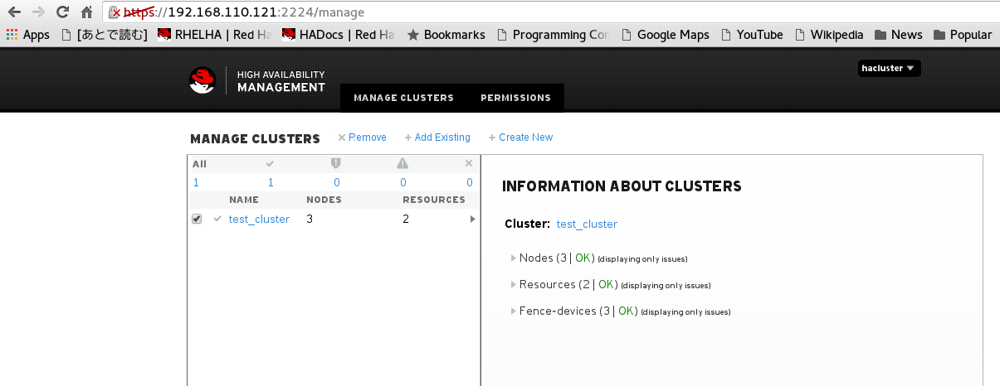
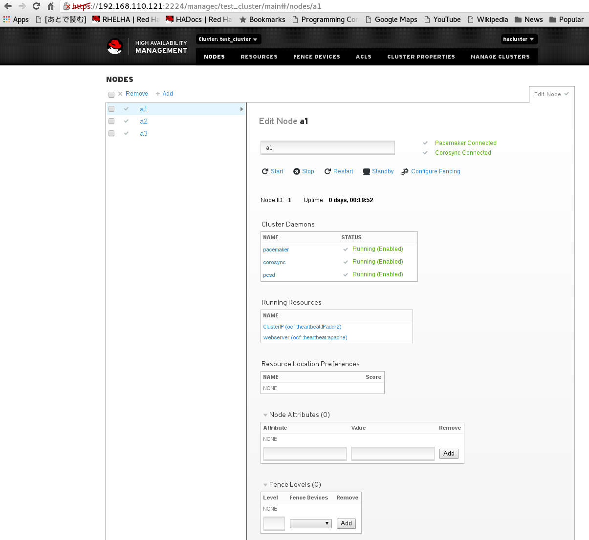
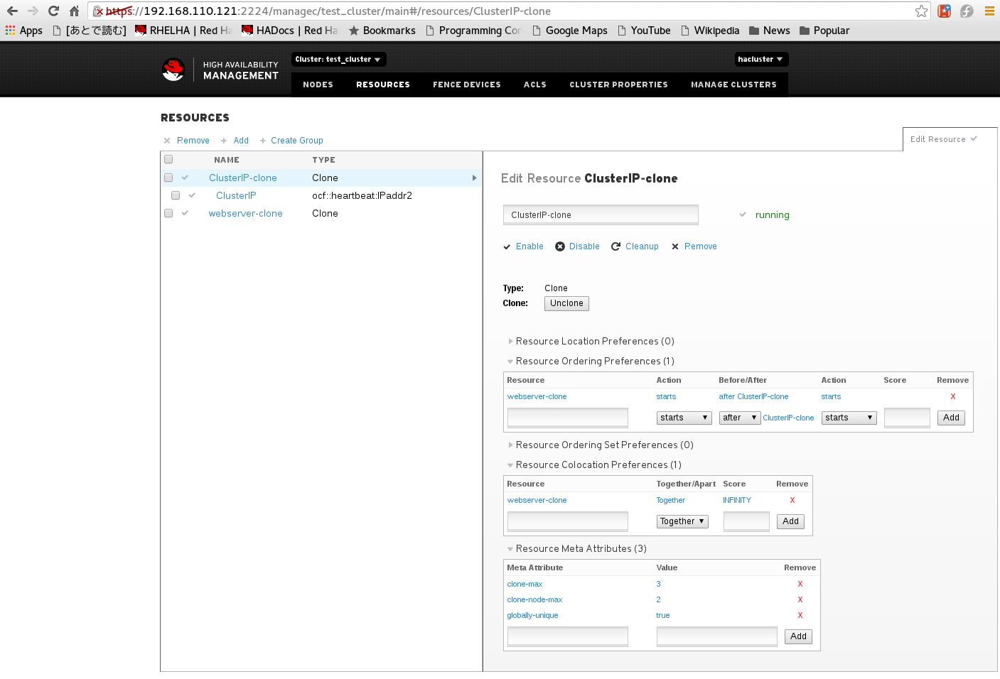

============================
PCSD Web UI
============================

pcsd Web UIは、pcsdが起動しているノードの2224番ポートにブラウザでアクセスすることができます。
認証画面では、hacluster/password でログインすることができます。
::

   https://nodename:2224

Web UIでできることは、下記記事に詳しく書かれています。
::
   
   https://access.redhat.com/documentation/ja-JP/Red_Hat_Enterprise_Linux/7/html/High_Availability_Add-On_Reference/ch-pcsd-HAAR.html

下記に、サンプル画面を幾つか掲載します。

	   
